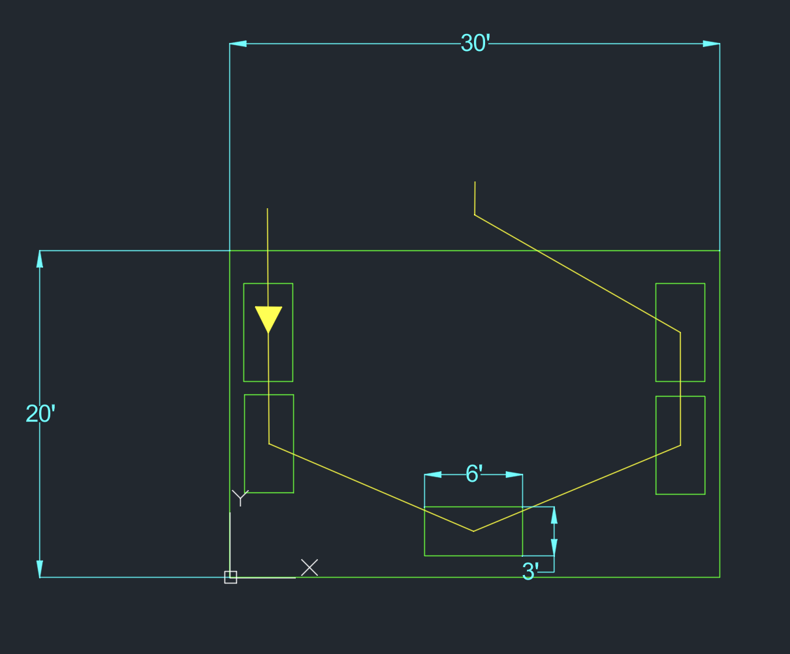

# Project: Industrial Engineering Facility Layout – U-Shaped Cell

## Project Overview
This project was created to help me build foundational AutoCAD skills that will support future digital drafting and facility layout design in Industrial Engineering.
It serves as an introductory CAD exercise focused on creating a simple U-shaped manufacturing cell while practicing precision drafting and engineering documentation.

## Objectives
- Build foundational AutoCAD skills
- Practice organizing drawings using layers
- Create a simple U-shaped manufacturing cell layout.
- Apply process flow visualization using leaders and routing paths.
- Add engineering dimensions to a technical drawing.

## Design Process
1. **Software Setup:** Configured AutoCAD software and imperial drawing units.
2. **Layer Management:** Created new, dedicated layers to organize the drawing.
3. **Room Construction:** Created a precise 30 ft × 20 ft facility layout boundary.
4. **Equipment Placement:** Arranged five 6 ft × 3 ft assembly tables into a functional U-shaped manufacturing cell.
5. **Flow Optimization:** Mapped sequential material flow using directional leaders and routing lines.
6. **Documentation:** Applied engineering dimensions for full traceability.
7. **Export & Publish:** Exported the drawing to PDF and uploaded all native project files to GitHub.

## Challenges Encountered
*Note: Learning AutoCAD for this project was a significant challenge. The platform's precise command syntax, strict input requirements, and finicky measurement tracking made the initial setup and layout process highly demanding.*

- **Object Snap Configuration:** Mastered adjusting and toggling Object Snaps (OSNAP) on AutoCAD for Mac to capture precise geometric center points of workstations instead of drawing misaligned lines.
- **Precision Spacing & Syntax:** Overcame strict entry constraints with relative coordinates and tracking settings to position all five tables neatly within a single room boundary.
- **Dimension Text Scale:** Resolved scaling issues where measurements initially appeared microscopic by modifying Dimension Styles (DIMSTYLE) to render text legibly at a facility-wide scale.
- **Layer Synchronization:** Learned proper active-layer management to ensure process paths, dimension extensions, and physical equipment stayed perfectly isolated on their intended layers.

## Skills Practiced
- **Technical Drawing:** Creating precise layout boundaries and scaling equipment layouts using standard floor-plan logic.
- **Layer & Asset Management:** Utilizing color-coded drafting layers to keep raw engineering data separated and organized.
- **Process Flow Visualization:** Mapping production steps sequentially to simulate product routing through an assembly environment.
- **Technical Problem Solving:** Troubleshooting software formatting, syntax requirements, and visual scales under constraints.

## Files Included
- [u_cell_layout.dwg](u_cell_layout.dwg) - The native, editable AutoCAD project file containing all layers and geometry.
- [u_cell_layout.pdf](u_cell_layout.pdf) - The formal, printed engineering blueprint ready for presentation.
- [u_cell_screenshot.png](u_cell_screenshot.png) - A high-resolution cropped layout rendering used for portfolio visualization.

## Key Takeaways
This lab demonstrated that facility layout design requires a strong balance between clear visual communication and geometric accuracy. Overcoming the initial challenges of command inputs, scaling dimension text, and alignment snap tools built a solid foundational understanding of computer-aided drafting that I will directly apply to future manufacturing cell configurations and factory design optimization.
