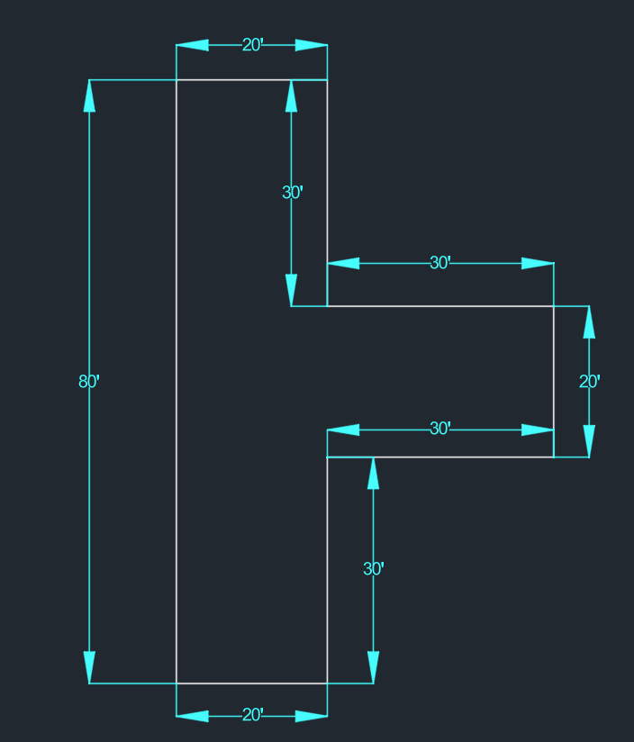

# AutoCAD Technical Competency Exercises

This section of the repository archives foundational engineering graphics work completed as target preparation for facilities and industrial engineering methodologies utilized at **The Boeing Company**. 

These technical drills directly track the structured curriculum from the [CAD in Black Beginner Tutorial](https://www.youtube.com/watch?v=MUgZDUdv60A), focusing on geometric precision, rapid workflow modification, and blueprint accuracy.

## Core Technical Skills Practiced
* **Coordinate Drafting**: Utilizing polar (`@length<angle`) and relative coordinates for absolute positional accuracy.
* **Geometric Modification**: Implementing `OFFSET`, `MIRROR`, `TRIM`, and solid `HATCH` boundaries to optimize drafting efficiency.
* **Dimensioning Standards**: Applying standardized `DIMLINEAR`, `DIMALIGNED`, and `DIMANGULAR` constraints across architectural and decimal scales.

### Exercise 1: Basic T-Shape Profile

* **Objective**: Learn the basics of drawing shapes with exact dimensions.
* **Commands Used**: `POLYLINE` (`PLINE`) and `Ortho Mode` (`F8`).
* **What I Learned**: 
  * How to lock lines to a perfectly straight 90-degree angle using Ortho Mode.
  * How to follow blueprint dimensions to trace a continuous path.
  * How to use the 'Close' command to complete the shape cleanly at the starting point.

