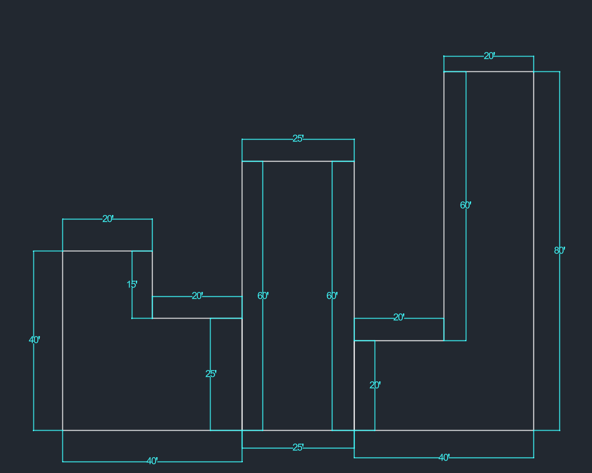
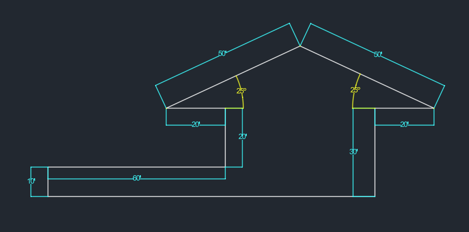
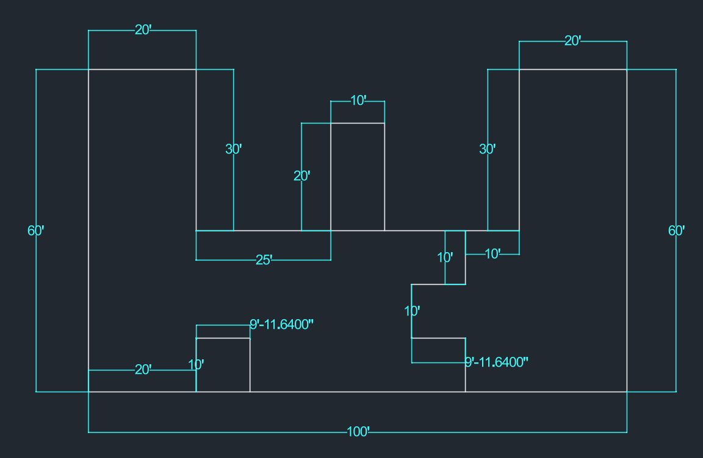
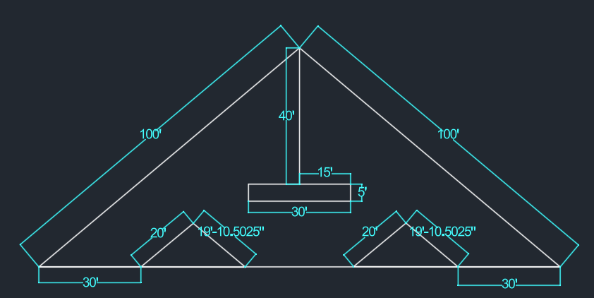

# AutoCAD Technical Competency Exercises

This section of the repository archives foundational engineering graphics work completed as target preparation for facilities and industrial engineering methodologies utilized at **The Boeing Company**. 

These technical drills directly track the structured curriculum from the [CAD in Black Beginner Tutorial](https://www.youtube.com/watch?v=MUgZDUdv60A), focusing on geometric precision, rapid workflow modification, and blueprint accuracy.

## Core Technical Skills Practiced
* **Coordinate Drafting**: Utilizing polar (`@length<angle`) and relative coordinates for absolute positional accuracy.
* **Geometric Modification**: Implementing `OFFSET`, `MIRROR`, `TRIM`, and solid `HATCH` boundaries to optimize drafting efficiency.
* **Dimensioning Standards**: Applying standardized `DIMLINEAR`, `DIMALIGNED`, and `DIMANGULAR` constraints across architectural and decimal scales.

### Exercise 1: Basic T-Shape Profile

* **Objective**: Learn the basics of drawing shapes with exact dimensions.
* **Commands Used**: `POLYLINE` (`PLINE`) and `Ortho Mode` (`F8`).
* **What I Learned**: 
  * How to lock lines to a perfectly straight 90-degree angle using Ortho Mode.
  * How to follow blueprint dimensions to trace a continuous path.
  * How to use the 'Close' command to complete the shape cleanly at the starting point.

### Exercise 2: Multi-Shape Profile Layout

* **Objective**: Practice drawing more complex combinations of shapes and managing internal layout spaces.
* **Commands Used**: `LINE`, `RECTANGLE` (`REC`), and `Ortho Mode` (`F8`).
* **What I Learned**:
  * How to transition from a basic single-line shape to drawing multiple standalone objects in one workspace.
  * How to use tracking vectors to leave exact spacing gaps (like the 20' paths) between separate shapes.
  * How to efficiently use the standard Rectangle command alongside precise manual coordinates to build vertical columns.

### Exercise 3: Angular Profile & Roof Layout

* **Objective**: Learn how to draw precise diagonal lines using lengths and specific degree constraints.
* **Commands Used**: `POLYLINE` (`PLINE`), `DIMALIGNED`, and `DIMANGULAR`.
* **What I Learned**:
  * How to input precise relative polar coordinates using the `@length<angle` format to construct symmetrical sloped geometry.
  * How to toggle Ortho Mode off to successfully draft complex angular paths without losing precision.
  * How to apply Aligned Dimensions (`DIMALIGNED`) for accurate true-length slanted measurements and Angular Dimensions (`DIMANGULAR`) to display roof pitch degrees.

### Exercise 4: Advanced Multi-Feature Layout

* **Objective**: Manage complex internal geometry with precise dimensional alignment across a large ($100'$) base footprint.
* **Commands Used**: `LINE`, `OFFSET`, and `DIMLINEAR`.
* **What I Learned**:
  * How to coordinate multiple vertical profiles while maintaining a unified, solid base floor plan.
  * **Troubleshooting & Precision Control**: Encountered a minor fractional precision variance (`9'-11.6400"` instead of a clean `10'`), highlighting the critical importance of exact object snapping (`OSNAP`) and unit tolerance verification in complex blueprints.

### Exercise 5: Complex Symmetrical Truss Layout

* **Objective**: Practice using duplication tools to build a complex, symmetrical structural frame.
* **Commands Used**: `LINE`, `COPY`, `MIRROR`, and `DIMALIGNED`.
* **What I Learned**:
  * How to use the **COPY** and **MIRROR** tools to instantly replicate the smaller inner triangles instead of drawing them from scratch.
  * **Precision Analysis**: Noticed a minor fractional variance (`19'-10.5025"` instead of a clean `20'`), which helps practice identifying where object snaps can catch tiny angle offsets over long distances.

