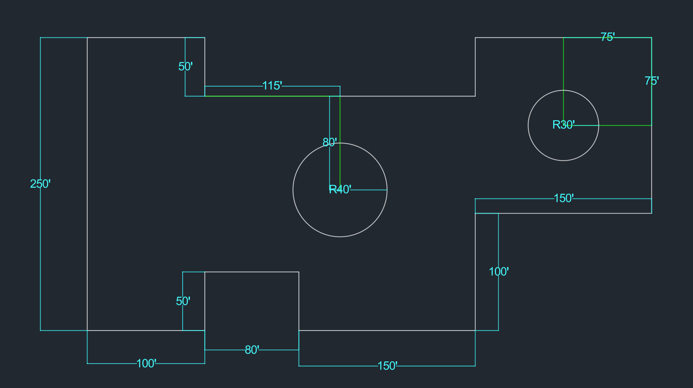
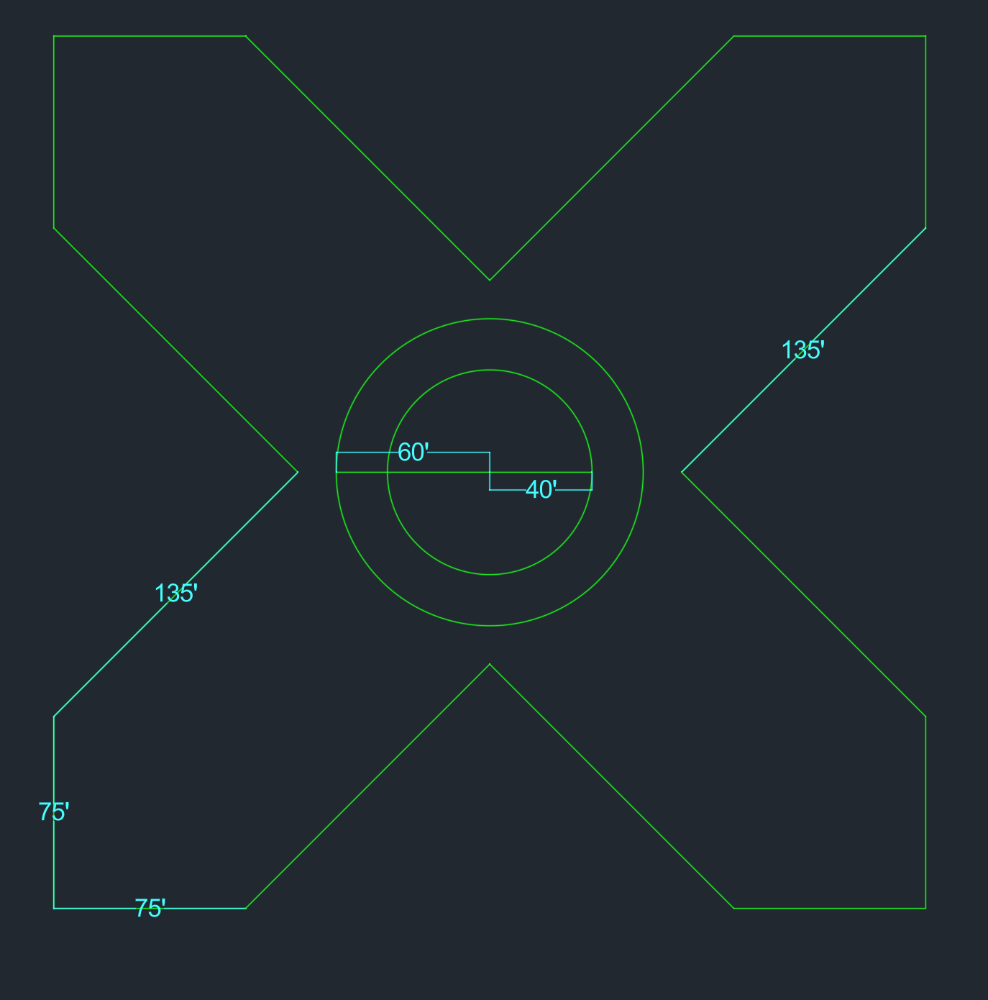

# AutoCAD Advanced Layout Practices

This section documents my progress with multi-feature mechanical and room layouts, focusing on structural blueprint precision and advanced object tracking methodologies based on the [CAD in Black Layout Curriculum](https://youtube.com).

## Core Technical Skills Practiced
* **Object Snap Tracking**: Using midpoint tracking alignments (`F11`) to accurately position internal elements without drawing temporary reference lines.
* **Mixed Dimensioning Rules**: Integrating linear coordinates (`DIMLINEAR`), radius indicators (`DIMRADIUS`), and explicit diameter constraints ($\varnothing$) within a single workspace.

---

## Layout Practice Catalog

### Practice 1: Multi-Feature Room Layout
* **Objective**: Recreate a complex closed-loop layout featuring symmetrical cutouts and precise interior circle placements.
* **Commands Used**: `LINE`, `POLYLINE` (`PLINE`), `CIRCLE` (Center-Diameter / Center-Radius), and `DIMLINEAR`.
* **What I Learned**:
  * How to route a continuous outer perimeter boundary while strictly adhering to flat linear dimensions.
  * How to use intersecting tracking vectors to locate the exact mathematical center of a $150 \times 150$ zone.
  * **Dimension Interpretation**: Accurately differentiated between radius constraints ($R40$ for an 80-unit total span) and diameter constraints ($\varnothing60$ for a 60-unit total span) to ensure 100% mathematical accuracy across all internal details.

### Practice 2: Symmetrical Cross Layout

* **Objective**: Apply precision tracking, circles, and angled inputs to draft a multi-point symmetrical object.
* **Commands Used**: `POLYLINE` (`PLINE`), `CIRCLE`, `DIMALIGNED`, and Polar Coordinates (`@distance<angle`).
* **What I Learned**:
  * How to construct matching $45^\circ$ diagonal corners using exact directional angles.
  * How to center concentric circular profiles inside a complex shape using object snap tracking.
  * How to verify slanted segment boundaries accurately using Aligned Dimensions (`DIMALIGNED`).

